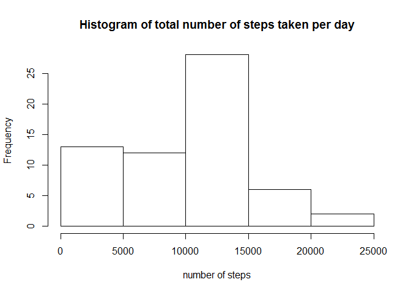
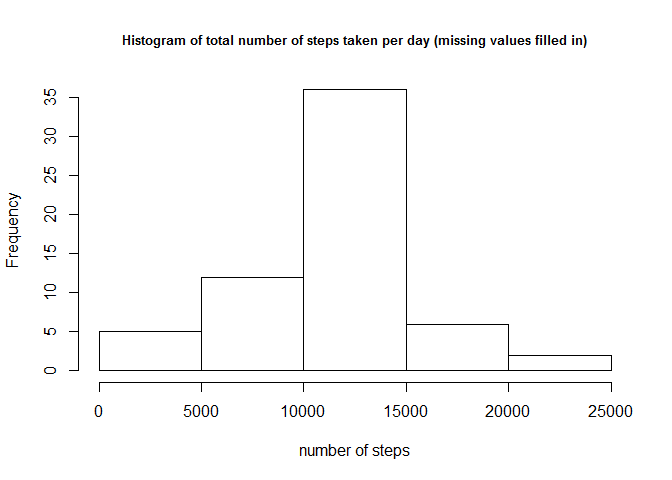
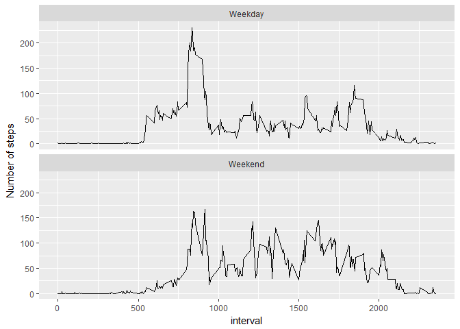

# Reproducible Research: Peer Assessment 1


##Loading and preprocessing the data

```r
library(dplyr)
```

```
## 
## Attaching package: 'dplyr'
```

```
## The following objects are masked from 'package:stats':
## 
##     filter, lag
```

```
## The following objects are masked from 'package:base':
## 
##     intersect, setdiff, setequal, union
```

```r
library(ggplot2)
activity <- read.csv("activity.csv")
```

##What is mean total number of steps taken per day?


```r
activity_grp <-group_by(activity,date)

meansteps <- summarise(activity_grp,smean =mean(steps,na.rm=TRUE),stot=sum(steps,na.rm=TRUE))

hist(meansteps$stot,main="Histogram of total number of steps taken per day",xlab="number of steps")
```

<!-- -->

```r
out_mean <- round(mean(meansteps$stot),0)
out_median <- median(meansteps$stot)
```

The above graph is a histogram of the total number of steps taken per day.

The mean number of steps per day is 9354 and the median number of steps is
 10395. 
 

## What is the average daily activity pattern?

```r
activity_grp2 <-group_by(activity,interval)
meansteps2 <- summarise(activity_grp2,smean =mean(steps,na.rm=TRUE),stot=sum(steps,na.rm=TRUE))

meansteps2a<- arrange(meansteps2,desc(smean))
maxint <- head(meansteps2a$interval,1)
maxstep <- round(max(meansteps2$smean),0)

plot(meansteps2$interval,meansteps2$smean,type="l",
     main="Average number of steps per interval",
     xlab="Interval",
     ylab="Average number of steps")
```

<!-- -->

The above graph shows the average number of steps by 5-minute interval during the day. The interval with the largest average number of steps is 835 with an average of 206.

## Imputing missing values

```r
isnas <-sum(is.na(activity$steps))

activity_grp2a <- mutate(activity_grp2,newsteps = ifelse(is.na(steps),mean(steps,na.rm=TRUE),steps))


activity_new <- activity
activity_new$steps <- activity_grp2a$newsteps

activity_new_grp <-group_by(activity_new,date)

meansteps_new <- summarise(activity_new_grp,smean =mean(steps,na.rm=TRUE),stot=sum(steps,na.rm=TRUE))

out_mean_new <- as.integer(round(mean(meansteps_new$stot),0))
out_median_new <- as.integer(median(meansteps_new$stot))

hist(meansteps_new$stot,main="Histogram of total number of steps taken per day (missing values filled in)",cex.main=c(0.8),xlab="number of steps")
```

<!-- -->

In the data set there are 2304 missing values. These missing values have been imputed by taking the average steps for that interval on other days. The above graph is a histogram of total number of steps per day. The mean of the number of steps taken is 10766  (before imputation; 9354) and the median is 10766 (before imputation; 10395).


## Are there differences in activity patterns between weekdays and weekends?

```r
activity_new_wkday <-mutate(activity_new,
                            weekday = ifelse(weekdays(as.Date(activity$date),abbreviate=TRUE)
                                             %in% c("Sat","Sun"),"Weekend","Weekday"))

str(activity_new_wkday$weekday)
```

```
##  chr [1:17568] "Weekday" "Weekday" "Weekday" "Weekday" "Weekday" ...
```

```r
activity_new_wkday2 <-group_by(activity_new_wkday,interval,weekday)
meansteps_wkday2 <- as.data.frame(summarise(activity_new_wkday2,smean =mean(steps,na.rm=TRUE),stot=sum(steps,na.rm=TRUE)))

meansteps_wkday2a <- meansteps_wkday2[meansteps_wkday2$weekday=="Weekday", ]

meansteps_wkday2b <- meansteps_wkday2[meansteps_wkday2$weekday=="Weekend", ]

ggplot(meansteps_wkday2,aes(x=interval,y=smean)) +
  geom_line()+facet_wrap(~weekday,nrow=2)+ylab("Number of steps")
```

<!-- -->

The above graph shows the average number of steps per 5-minute interval, split between whether the day was a weekday or weekend.
